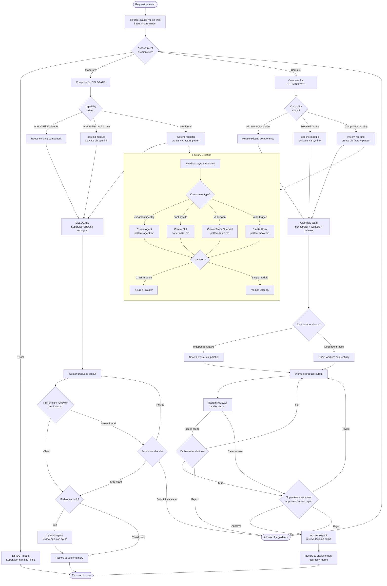

# Supervisor Decision Flow

Decision flowchart for the Neuron Supervisor. Every branch maps to documented
behavior in CLAUDE.md, ARCHITECTURE.md, RULES.md, or factory/README.md.

## Branch Reference

| Decision Node | Source | Section |
|---------------|--------|---------|
| enforce-claude-md.sh fires | ARCHITECTURE.md | Hook Flow |
| Assess intent & complexity | CLAUDE.md | Intent-Based Approach |
| Trivial / Moderate / Complex | CLAUDE.md | Intent-Based Approach table |
| DIRECT mode | ARCHITECTURE.md | Execute Modes |
| DELEGATE mode | ARCHITECTURE.md | Execute Modes |
| COLLABORATE mode | ARCHITECTURE.md | Execute Modes |
| Capability exists? | ARCHITECTURE.md | Orchestration Pipeline |
| ops-init-module activate | ARCHITECTURE.md | Orchestration Pipeline, Module Lifecycle |
| system-recruiter create | ARCHITECTURE.md | When to Trigger Recruiter |
| Compose (skill/agent/team) | CLAUDE.md | Supervisor Responsibilities, step 2 |
| Reuse existing component | factory/README.md | Before Creating, step 2 |
| Spawn parallel vs sequential | ARCHITECTURE.md | Team Assembly |
| Workers produce output | ARCHITECTURE.md | Collaborate Flow, step 2 |
| system-reviewer audit | CLAUDE.md | Supervisor Responsibilities, step 4 |
| Reviewer reports only | ARCHITECTURE.md | Collaborate Flow, step 4 |
| Orchestrator decides fix/skip | ARCHITECTURE.md | Collaborate Flow, step 5-6 |
| Supervisor checkpoint | ARCHITECTURE.md | Orchestration Pipeline |
| ops-retrospect | CLAUDE.md | Supervisor Responsibilities, step 5 |
| Moderate+ trigger | ops-retrospect SKILL.md | When to Activate |
| Record to vault/memory | ARCHITECTURE.md | Orchestration Pipeline (ops-daily-memo) |
| Factory pattern selection | factory/README.md | Component Selection Guide, Decision Tree |
| Location decision | factory/README.md | Location Decision |
| Ask user for guidance | CLAUDE.md | Principles (Autonomy - ask what you cannot find) |
